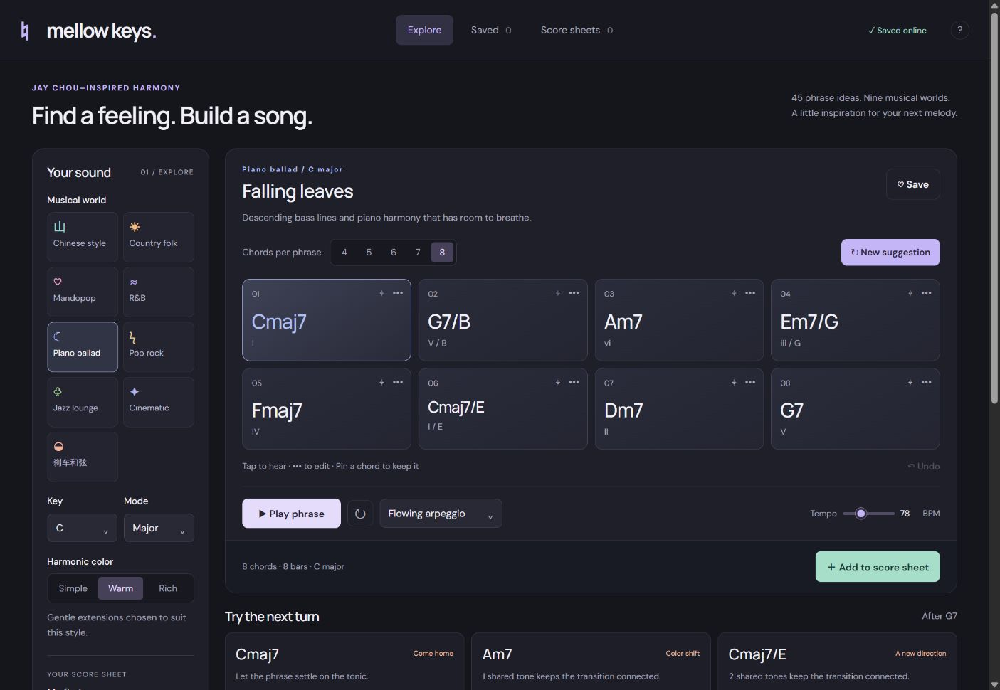

# Mellow Keys

**Find a feeling. Build a song.** A chill piano chord studio for exploring harmony, keeping favorite ideas, and turning phrases into a score.



## Launch on Windows — no terminal

1. Download **MellowKeys-1.0.0-Windows-x64.zip** from the [latest release](https://github.com/FanZhu1998/MellowKeys/releases/latest).
2. Extract the ZIP completely to a folder you control.
3. Double-click **MellowKeys.exe**. Keep the other files beside it.

No Node.js installation, account, API key, or internet connection is needed. Piano samples, UI fonts, and notation fonts are included. This is a portable, unsigned Windows x64 build; it does not install a background service or automatically update itself.

Your desktop library is saved separately in `%APPDATA%\Mellow Keys\library.sqlite`. Replacing the app folder preserves it. Close Mellow Keys before backing up the data folder. The hosted web edition has its own account-based library; it does not automatically synchronize with the desktop app.

## Inspiration

Mellow Keys grew from a love of Jay Chou's range: lyrical piano ballads, Mandarin pop hooks, R&B harmony, Chinese-style melodies, country textures, and rock energy. The app turns that curiosity into original starting points for your own writing.

The nine musical worlds include Chinese style, country folk, Mandopop, R&B, piano ballad, pop rock, jazz lounge, cinematic, and **刹车和弦**. These are curated harmony prompts and voice-leading rules, not song transcriptions, a model trained on his catalog, or claims about measured chord frequencies. No recordings, lyrics, or melodies from his songs are included. This is an independent project, without affiliation or endorsement.

## What you can do

- Explore **45 phrase families**, major and minor keys, and Simple / Warm / Rich chord colors.
- Generate **4–8 chords**, preview each one, pin favorites across suggestions, replace chord qualities, and append suggested next chords.
- Hear a sampled Salamander grand piano with soft, broken, flowing, rolled, or pop-pulse playback; adjust tempo, volume, and looping.
- Try suspended, added-note, seventh, ninth, thirteenth, half-diminished, minor-major, borrowed, and slash-chord colors.
- Explore the requested brake colors: **F♯–A–C–E / F♯m7♭5** in C, and **Am7 → Am(maj7) → Dsus4**. Broken-chord playback is a separate technique.
- Save named favorites and append phrases consecutively into multiple score sheets.
- Rename, reorder, duplicate, and play score phrases while preserving each phrase's key, tempo, pattern, and exact voiced notes.
- Export **PDF** on desktop, **Print / Save PDF** on the web, or **MusicXML** for further editing in notation software.

Scores are piano voicing reductions: one whole-note chord per 4/4 bar, with two staves, chord symbols and continuous bar numbers. Playback arpeggios are not fully transcribed as rhythmic accompaniment.

## A simple writing flow

Choose a musical world and key → choose 4–8 chords → listen and shape the phrase → Save an idea you like → Add to score sheet → continue with the next phrase → arrange and export.

Tap a chord to hear it. Use its pin to preserve it during a new suggestion and its **•••** menu to change it. Space plays or stops when focus is outside a text field or control. Menus, tabs, and dialogs support keyboard navigation, and the interface respects reduced-motion preferences.

## Develop

Use **Node.js 24 or newer**. All package versions are pinned in the lockfile.

```sh
npm ci
npm run dev
```

The command prints a loopback preview URL. Development data stays in the ignored `.local-data/` directory.

```sh
npm run check          # tests, secret scan, web build
npm audit             # known dependency vulnerabilities
npm run desktop:build # Windows x64 folder under release/
npm run db:generate   # additive schema migration, when needed
```

For a new hosted instance, copy `.openai/hosting.example.json` to the ignored `.openai/hosting.json` and register your own project. Do not commit the generated project binding or credentials. The Worker requires a trusted authenticated gateway; see [SECURITY.md](SECURITY.md).

## Designed for future updates

The music engine, workspace validation, request transport, conflict recovery, score engraving, MusicXML export, host integration, and desktop security live in separate modules. Both hosts share the same logic and ordered database migrations. Workspace schema versions and saved chord IDs are explicit; newer unknown data is rejected rather than overwritten.

See [Architecture and update rules](docs/ARCHITECTURE.md), [Changelog](CHANGELOG.md), and [Security and privacy](SECURITY.md). CI verifies source and tests; a version tag or manual run also builds a Windows artifact.

## Credits and license

Application code follows the repository's [MIT license](LICENSE), copyright 2026 Fan Zhu. Piano samples are **Salamander Grand Piano by Alexander Holm, CC BY 3.0**, selected and pitch-shifted through the app. Engraving uses VexFlow with Bravura and Academico fonts; UI typography uses DM Sans and Manrope. See [Third-party notices](THIRD_PARTY_NOTICES.md) for their separate licenses.
